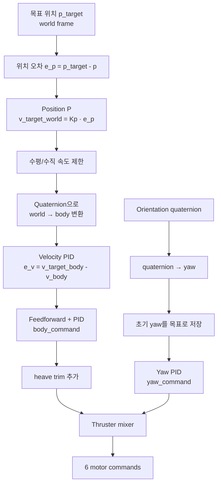

# BlueROV PPID Controller

BlueROV2의 위치 목표를 6개 추진기 명령으로 변환하는 계층형 위치 제어기 문서다.
이 구현에서 `PPID`는 별도의 단일 알고리즘 이름이라기보다 다음 제어 구조를 뜻한다.

- 위치 오차를 속도 목표로 바꾸는 P 제어기
- 속도 오차를 body-frame 제어량으로 바꾸는 3축 PID 제어기
- 초기 yaw를 유지하는 yaw PID 제어기
- 제어량을 6개 추진기 명령으로 변환하는 mixer

## 1. 전체 구조

```mermaid
flowchart LR
    Mission[/mission/target_position] --> Planner[team_min A* Planner]
    Planner --> Path[/uuv/reference_path]
    Path --> Follower[PathFollower\nlookahead target selection]
    Follower --> Target[/ppid/tracking_target\nPointStamped]

    Odom[BlueROV Odometry] --> Hub[DataHub snapshot]
    DVL[DVL, optional] --> Hub
    Hub --> Module[ControlModule]
    Target --> Module

    Module --> Guard{Fresh, finite,\nframe valid?}
    Guard -- No --> Stop[Publish zero thrust\nreset controller]
    Guard -- Yes --> PPID[BlueRovPPIDController]

    PPID --> Mix[ThrusterMixer]
    Mix --> T1[/thruster1_joint/cmd_thrust]
    Mix --> T2[/thruster2_joint/cmd_thrust]
    Mix --> T3[/thruster3_joint/cmd_thrust]
    Mix --> T4[/thruster4_joint/cmd_thrust]
    Mix --> T5[/thruster5_joint/cmd_thrust]
    Mix --> T6[/thruster6_joint/cmd_thrust]

    PPID -. telemetry .-> Logger[Async PpidLogger]
    Logger --> CSV[ppid_session_*.csv]
    CSV --> HTML[*_plot.html]
```

### 데이터 연결

1. `team_min`의 A* planner가 `/uuv/reference_path`를 생성한다.
2. `PathFollower`가 현재 위치와 경로를 이용해 lookahead waypoint 하나를 선택한다.
3. 선택한 점을 `geometry_msgs/msg/PointStamped` 형태의 `/ppid/tracking_target`으로 전달한다.
4. `ControlModule`은 `DataHub`의 odometry 또는 DVL snapshot과 tracking target을 검증한다.
5. 검증을 통과하면 `BlueRovPPIDController::update()`가 6개 추진기 명령을 계산한다.

관련 구현은 [`PathFollower`](../include/bluerov_integration/integration/path_follower.hpp), [`ControlModule`](../include/bluerov_integration/team_byung/control_module.hpp), [`PPID controller`](../include/bluerov_integration/team_byung/ppid_controller.hpp)에서 확인할 수 있다.

## 2. 제어 루프



제어 주기는 기본적으로 `rate_hz: 20.0`으로 설정되어 nominal `dt`는 `0.05 s`다. 실제 update 사이의 경과 시간을 사용하며, 유효하지 않은 `dt`가 내부 PID에 들어오면 `0.01 s`로 대체한다.

### 2.1 위치 P 제어

위치 오차를 world frame의 목표 속도로 변환한다.

```text
e_p = p_target_world - p_current_world
v_target_world = K_position ⊙ e_p
```

`x-y` 수평 속도는 `max_horizontal_speed`, `z` 속도는 `max_vertical_speed`로 제한한다. 기본값은 각각 `3.0`, `1.5`다.

### 2.2 좌표계 변환

위치 제어기가 만든 world-frame 목표 속도를 현재 자세 quaternion으로 body frame에 변환한다.
이후 속도 PID는 odometry 또는 DVL에서 얻은 body-frame 속도와 비교한다.

```text
v_target_body = R_world_to_body(q) · v_target_world
```

속도 입력은 `control.velocity_source`로 선택한다.

- `odometry`: BlueROV odometry의 `twist.twist.linear`
- `dvl`: DVL의 `velocity.twist.linear` (DVL 데이터가 stale이면 제어 정지)

### 2.3 속도 PID

각 축에 대해 다음 값을 계산한다.

```text
e_v       = v_target_body - v_current_body
integral  = clamp(integral + e_v · dt, ±integral_limit)
derivative = (e_v - e_v_previous) / dt
feedforward = gain_ff · target_axis · |target_axis|

command = feedforward + kp·e_v + ki·integral + kd·derivative
command = clamp(command, ±output_limit)
```

적분항은 anti-windup를 위해 `integral_limit`로 제한한다. 속도 PID는 target 변경 자체만으로 reset하지 않으며, 새로운 mission이 시작되거나 센서/target 검증 실패로 제어가 deactivate될 때 reset한다.

### 2.4 Yaw 제어

첫 번째 유효한 update에서 현재 yaw를 목표 yaw로 저장하고, 이후 yaw를 유지한다. 각도 오차는 `[-π, π]` 범위로 정규화한다.

```text
e_yaw = normalize(target_yaw - current_yaw)
yaw_command = kp·e_yaw + ki·integral - kd·yaw_rate
```

새 mission이 시작되면 yaw controller도 reset되며, 다음 유효한 update에서 새로운 초기 yaw를 저장한다.

### 2.5 Heave trim 및 추진기 mixing

속도 PID의 z 제어량에 `heave_trim`을 더한 뒤, surge(`x`), sway(`y`), heave(`z`), yaw 명령을 6개 추진기에 분배한다.

```text
motor[i] =
    x_coeff[i]   · body_command.x
  + y_coeff[i]   · body_command.y
  + z_coeff[i]   · body_command.z
  + yaw_coeff[i] · yaw_command
```

현재 mixer는 수평 추진기 1~4와 수직 추진기 5~6을 별도로 desaturation한다. 각 그룹에서 최대 절대값이 `command_limit`을 넘으면 그룹 전체를 같은 비율로 축소한다.

> 주의: 현재 mixer 계수의 부호와 실제 모터 번호 대응은 SITL 또는 실제 기체에서 단독 방향 시험이 필요하다.

## 3. ROS 인터페이스

### 입력

| 데이터 | 기본 위치 | 용도 |
|---|---|---|
| Tracking target | `/ppid/tracking_target` | PathFollower가 선택한 목표 위치 |
| BlueROV odometry | DataHub snapshot | 위치, 자세, 속도, yaw rate |
| DVL | DataHub snapshot | `velocity_source: dvl`일 때 속도 입력 |

### 출력

기본 출력 토픽은 다음과 같다.

| 추진기 | 토픽 |
|---:|---|
| 1 | `/model/bluerov2/joint/thruster1_joint/cmd_thrust` |
| 2 | `/model/bluerov2/joint/thruster2_joint/cmd_thrust` |
| 3 | `/model/bluerov2/joint/thruster3_joint/cmd_thrust` |
| 4 | `/model/bluerov2/joint/thruster4_joint/cmd_thrust` |
| 5 | `/model/bluerov2/joint/thruster5_joint/cmd_thrust` |
| 6 | `/model/bluerov2/joint/thruster6_joint/cmd_thrust` |

모든 출력 메시지는 `std_msgs/msg/Float64`다.

## 4. 유효성 검사와 fail-safe

`ControlModule`은 매 update 전에 다음 조건을 검사한다.

- BlueROV odometry가 존재하고 `odometry_timeout_sec` 이내인지
- tracking target이 valid하고 timeout 조건을 만족하는지
- target 좌표가 finite인지
- target frame과 odometry frame이 일치하는지
- `velocity_source: dvl`이면 DVL이 최신인지

조건을 하나라도 만족하지 못하면 해당 제어 cycle에서 추진기 명령을 내보내지 않고, 제어가 활성 상태였다면 6개 추진기에 모두 `0.0`을 publish한 뒤 controller state를 reset한다. `target_timeout_sec <= 0`이면 마지막 tracking target을 계속 유지한다.

mission sequence가 바뀌면 PID와 yaw hold 상태를 초기화한다. waypoint만 변경된 경우에는 목표 위치를 갱신하고 기존 PID 상태를 유지한다.

## 5. 주요 파라미터

설정 파일: [`config/integration.yaml`](../config/integration.yaml)

| 파라미터 | 기본값 | 설명 |
|---|---:|---|
| `control.rate_hz` | `20.0` | 제어 loop 주파수 |
| `control.velocity_source` | `odometry` | `odometry` 또는 `dvl` |
| `control.odometry_timeout_sec` | `0.5` | odometry stale 기준 |
| `control.dvl_timeout_sec` | `0.5` | DVL stale 기준 |
| `control.target_timeout_sec` | `0.0` | `0 이하`: 마지막 목표 유지 |
| `control.position_gain.{x,y,z}` | `1.5` | 위치 P gain |
| `control.max_horizontal_speed` | `3.0` | 수평 목표 속도 제한 |
| `control.max_vertical_speed` | `1.5` | 수직 목표 속도 제한 |
| `control.velocity_pid.{x,y,z}` | 축별 상이 | 속도 PID 및 출력 제한 |
| `control.velocity_feedforward.{x,y,z}` | `47.7043, 76.5938, 0` | 속도 feedforward gain |
| `control.yaw_pid` | `80.0, 2.0, 10.0` | yaw PID gain |
| `control.heave_trim` | `11.0` | z 제어량에 더하는 trim |
| `control.mixer.command_limit` | `120.0` | 추진기 그룹별 최대 명령 |

속도 PID의 현재 기본값은 다음과 같다.

| 축 | kp | ki | kd | integral limit | output limit |
|---|---:|---:|---:|---:|---:|
| x | 60.0 | 0.5 | 1.0 | 2.0 | 450.0 |
| y | 60.0 | 0.5 | 1.0 | 2.0 | 450.0 |
| z | 70.0 | 0.5 | 1.0 | 2.0 | 100.0 |

## 6. 로깅 및 분석

`PpidLogger`는 제어 loop를 막지 않도록 bounded queue와 별도 worker thread를 사용한다.

- 기본 디렉터리: `ppid_logs/`
- CSV: `ppid_session_YYYYMMDD_HHMMSS.csv`
- HTML: `ppid_session_YYYYMMDD_HHMMSS_plot.html`
- 기본 queue limit: `10000`
- queue가 가득 차면 가장 오래된 entry를 버리고 overflow count를 증가시킨다.

CSV에는 시간, control dt, 목표/현재 위치, 위치 오차, 목표/현재 속도, 속도 오차, body command, yaw 상태, 6개 motor command가 기록된다. tracking target이 바뀐 행은 `event`가 `TARGET_UPDATED`로 표시된다.

```yaml
control:
  logging:
    enabled: true
    generate_html: true
    directory: "ppid_logs"
    queue_limit: 10000
```

## 7. 파일 구조

```text
src/bluerov_integration/
├── include/bluerov_integration/team_byung/
│   ├── ppid_controller.hpp       # 제어기와 설정 자료구조
│   ├── control_module.hpp        # ROS/DataHub 연결부
│   └── ppid_logger.hpp           # 비동기 CSV logger
├── src/team_byung/
│   ├── ppid_controller.cpp       # P, PID, yaw, frame transform, mixer
│   ├── control_module.cpp        # 입력 검증, update, thruster publish
│   ├── ppid_logger.cpp           # CSV 기록 및 HTML 생성 호출
│   └── ppid_log_plot.cpp         # CSV 기반 HTML plot 생성
├── src/integration/
│   └── path_follower.cpp         # 경로에서 tracking target 선택
├── config/
│   └── integration.yaml          # PPID 및 path following 설정
└── docs/
    └── PPID_CONTROLLER.md        # 본 문서
```

## 8. 시험 시 확인할 항목

1. SITL에서 target frame과 odometry frame이 동일한지 확인한다.
2. 정지 상태에서 각 축 명령의 방향이 기대한 이동 방향과 일치하는지 확인한다.
3. yaw 방향과 motor 1~6의 실제 배치가 mixer 계수와 일치하는지 확인한다.
4. odometry와 DVL을 각각 선택해 stale timeout 및 zero-thrust 동작을 확인한다.
5. `ppid_logs/*_plot.html`에서 target 변경 시점, 오차 수렴, motor saturation, logger overflow를 확인한다.

## 관련 문서

- [PathFollower 인수인계](./PATH_FOLLOWER_HANDOFF.md)
- [PPID controller header](../include/bluerov_integration/team_byung/ppid_controller.hpp)
- [Control module implementation](../src/team_byung/control_module.cpp)
