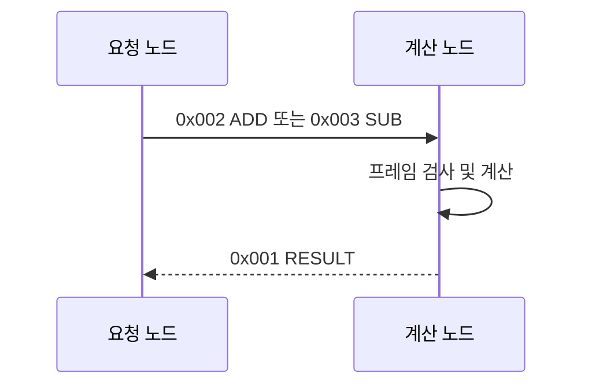

# CAN 계산기 통신 명세서

> 문서 상태: 초안 v1.0  
> 프로토콜 버전: `0x01`  
> 이 문서는 CAN 계산기 통신 규격의 단일 기준 문서(Single Source of Truth)이다.

## 1. 문서 목적

두 대의 ESP32-S3가 CAN 버스로 덧셈과 뺄셈을 수행할 때 사용할 메시지 ID와 데이터 형식을 정의한다.

- **요청 노드(Client)**: 연산 요청을 보내고 결과를 받는다.
- **계산 노드(Server)**: 요청을 받아 계산한 뒤 결과를 보낸다.

CAN 업계에서는 이런 표를 **CAN 메시지 매트릭스(CAN Communication/Message Matrix)**라고 부른다. 장비가 읽는 표준 파일이 필요해지면 이 문서를 기준으로 DBC 파일을 추가한다.

## 2. 전체 구성



### 담당자 분담

| 담당 | 구현 범위 |
|---|---|
| 담당자 A | 요청 노드: 요청 생성, sequence 관리, 결과 수신, 타임아웃 및 재전송, 결과 표시 |
| 담당자 B | 계산 노드: 요청 수신, 유효성 검사, 계산, 결과 송신, 오류 및 bus-off 처리 |
| 공동 | 공통 프로토콜 상수와 encode/decode 코드 리뷰, 테스트 벡터 및 실기 통합 시험 |

두 담당자는 메시지 구조를 각자 새로 정의하지 않고, 동일한 공통 헤더와 codec을 사용해야 한다.

## 3. 통신 기본값

| 항목 | 규격 |
|---|---|
| CAN 방식 | Classical CAN 2.0A |
| Identifier | 11-bit Standard ID |
| 프레임 | Data Frame (`RTR=0`) |
| 데이터 길이 | 모든 메시지 DLC 8 |
| 비트레이트 | 500 kbit/s |
| 바이트 순서 | Little Endian (Intel) |
| 부호 표현 | signed 정수, 2의 보수 |
| 동시 요청 | 요청 노드당 미완료 요청 1개만 허용 |
| 응답 제한 시간 | 100 ms |
| 재전송 | 같은 sequence로 최대 1회 |

ID는 문서와 코드에서 항상 `0x001`, `0x002`, `0x003`처럼 16진수로 표기한다.

## 4. CAN 메시지 매트릭스

| CAN ID | 메시지 이름 | 송신 → 수신 | 주기 | DLC | 의미 |
|---:|---|---|---|---:|---|
| `0x001` | `CALC_RESULT` | 계산 노드 → 요청 노드 | Event | 8 | 계산 결과 또는 처리 오류 |
| `0x002` | `CALC_ADD_REQ` | 요청 노드 → 계산 노드 | Event | 8 | `A + B` 요청 |
| `0x003` | `CALC_SUB_REQ` | 요청 노드 → 계산 노드 | Event | 8 | `A - B` 요청 |

`0x001`의 송신자는 버스에서 정확히 하나여야 한다. 이 버전은 요청 노드 1대와 계산 노드 1대를 전제로 한다.

## 5. 요청 프레임

`CALC_ADD_REQ(0x002)`와 `CALC_SUB_REQ(0x003)`는 같은 데이터 형식을 사용한다.

| Byte | 필드 | 형식 | 규칙 |
|---:|---|---|---|
| 0 | `version` | `uint8` | 반드시 `0x01` |
| 1 | `sequence` | `uint8` | 요청 식별자, `0`~`255` 순환 |
| 2–3 | `operand_a` | `int16` LE | 첫 번째 피연산자, `-32768`~`32767` |
| 4–5 | `operand_b` | `int16` LE | 두 번째 피연산자, `-32768`~`32767` |
| 6–7 | `reserved` | 2 bytes | 송신 시 모두 `0x00` |

연산 규칙:

- ID `0x002`: `result = operand_a + operand_b`
- ID `0x003`: `result = operand_a - operand_b`
- 뺄셈의 순서는 반드시 `A - B`이다.

입력을 `int16`, 결과를 `int32`로 사용하므로 정상적인 덧셈과 뺄셈 결과는 오버플로하지 않는다.

## 6. 결과 프레임

| Byte | 필드 | 형식 | 규칙 |
|---:|---|---|---|
| 0 | `version` | `uint8` | `0x01` |
| 1 | `sequence` | `uint8` | 요청의 값을 그대로 반환 |
| 2 | `operation` | `uint8` | ADD=`0x02`, SUB=`0x03` |
| 3 | `status` | `uint8` | 아래 상태 코드 참조 |
| 4–7 | `result` | `int32` LE | 정상 결과. 오류 응답에서는 `0` |

### 상태 코드

| 값 | 이름 | 의미 |
|---:|---|---|
| `0x00` | `OK` | 정상 처리 |
| `0x01` | `INVALID_FORMAT` | reserved 값 등 프레임 형식 오류 |
| `0x02` | `UNSUPPORTED_VERSION` | 지원하지 않는 프로토콜 버전 |
| `0x03` | `INTERNAL_ERROR` | 계산 노드 내부 처리 오류 |

## 7. 송수신 동작 규칙

1. 요청 노드는 현재 미완료 요청이 없을 때만 새 요청을 보낸다.
2. 새 요청마다 `sequence`를 1 증가시키며 `255` 다음은 `0`이다.
3. 계산 노드는 유효한 요청을 받은 순서대로 처리하고 요청마다 결과 한 개를 보낸다.
4. 요청 노드는 `version`, `sequence`, `operation`, `status`가 기대값과 맞는지 확인한 뒤 결과를 사용한다.
5. 100 ms 안에 유효한 응답이 없으면 동일 프레임을 동일한 sequence로 한 번 재전송한다.
6. 재전송 후 다시 100 ms 동안 응답이 없으면 해당 요청을 실패로 처리한다.
7. 계산 노드는 재전송된 동일 요청도 다시 처리하고 같은 계산 결과를 응답한다. 계산은 부작용이 없으므로 안전하다.
8. 요청 노드는 이미 완료한 sequence의 늦은 중복 응답을 무시한다.

### 잘못된 프레임 처리

| 조건 | 계산 노드 동작 |
|---|---|
| DLC가 8이 아님 | 읽지 않고 폐기, 응답 없음 |
| Extended ID 또는 RTR 프레임 | 무시 |
| 알 수 없는 CAN ID | 무시 |
| version이 `0x01`이 아님 | `UNSUPPORTED_VERSION`, result=`0` 응답 |
| reserved가 `0x0000`이 아님 | `INVALID_FORMAT`, result=`0` 응답 |

CAN 프레임 자체에 CRC가 있으므로 v1 애플리케이션 데이터에는 별도 CRC를 추가하지 않는다.

## 8. 바이트 예제

### 예제 1: `1000 + (-250) = 750`

sequence는 `0x2A`이다.

```text
ADD 요청
ID:   0x002
DATA: 01 2A E8 03 06 FF 00 00
      VV SS [ A   ] [ B   ] [RSV]

정상 결과
ID:   0x001
DATA: 01 2A 02 00 EE 02 00 00
      VV SS OP ST [  RESULT  ]
```

### 예제 2: `10 - 25 = -15`

```text
SUB 요청
ID:   0x003
DATA: 01 2B 0A 00 19 00 00 00

정상 결과
ID:   0x001
DATA: 01 2B 03 00 F1 FF FF FF
```

## 9. 하드웨어 주의사항

ESP32-S3에는 CAN 프로토콜 컨트롤러(TWAI)가 있지만 CAN_H/CAN_L에 직접 연결할 수 있는 물리 계층 트랜시버는 내장되어 있지 않다.

- 각 보드에 ESP32-S3의 3.3 V 로직과 호환되는 CAN 트랜시버가 필요하다.
- 두 보드의 `CAN_H`, `CAN_L`, `GND`를 각각 연결한다.
- 버스 양 끝에만 120 Ω 종단저항을 하나씩 설치한다. 전원을 끄고 CAN_H–CAN_L 사이를 측정하면 보통 약 60 Ω이다.
- 두 노드는 반드시 같은 500 kbit/s 설정을 사용한다.
- TWAI TX/RX GPIO는 배선에 맞춰 빌드 설정으로 지정하며 소스에 임의로 고정하지 않는다.

## 10. 시험 항목

- `0`, 양수, 음수를 포함한 덧셈과 뺄셈
- `-32768`, `32767` 경계 입력
- `A - B` 순서와 음수 결과
- Little Endian encode/decode
- sequence 일치 및 `255 → 0` 순환
- 잘못된 DLC, ID, 프레임 종류 무시
- 잘못된 version과 reserved의 오류 응답
- 응답 타임아웃, 동일 sequence 재전송, 중복 응답 무시
- 연속 요청의 응답 순서
- CAN bus-off 발생 감지와 복구
- 두 실제 보드 및 CAN 분석기에서 예제 바이트 일치 확인

## 11. 구현 전 확정할 하드웨어 값

아래 값은 보드 배선을 보고 두 담당자가 확정해야 한다.

| 항목 | 현재 값 |
|---|---|
| 요청 노드 TWAI TX GPIO | 미정 |
| 요청 노드 TWAI RX GPIO | 미정 |
| 계산 노드 TWAI TX GPIO | 미정 |
| 계산 노드 TWAI RX GPIO | 미정 |
| CAN 트랜시버 모델 | 미정 |

## 12. 변경 이력

| 문서 버전 | 날짜 | 변경 내용 |
|---|---|---|
| 1.0-draft | 2026-09-12 | 최초 CAN ID, payload, 오류 및 시험 규칙 정의 |

